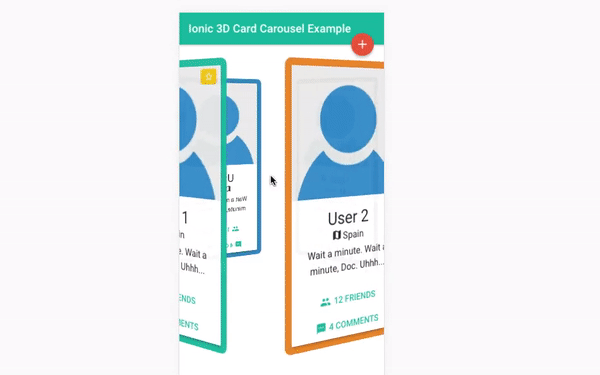

# Ionic-3D-Card-Carousel

Sample project that shows an experimental 3D card carousel in Ionic.

* FrontEnd: Ionic App.

## Running

Before you go through this example, you should have at least a basic understanding of Ionic concepts. You must also already have Ionic installed on your machine.

* Test in localhost:

```bash
npm install
ionic serve
```

* Test in Android: 

```bash
ionic cordova add platform android
ionic cordova run android
```

* Test in iOS: 

```bash
ionic cordova add platform ios
ionic cordova run ios
```



## Requirements

* [Node.js](http://nodejs.org/)
* [Ionic Cordova](https://ionicframework.com/docs/intro/installation/)


